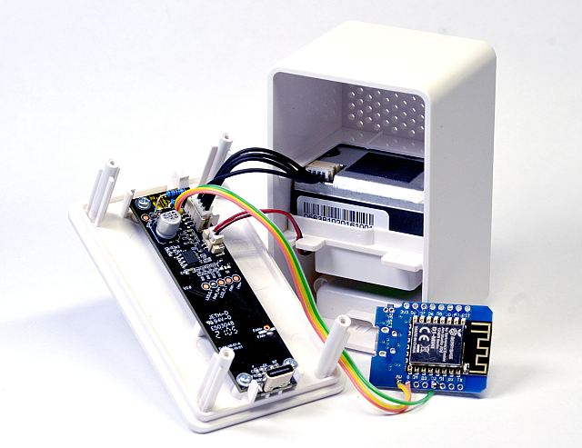

# Ikea Vindriktning Web Server 



## Installation
* Change the **ssid and the password** to your own.
* Flash ```*.ino``` file to your ESP8266.

## Credits 
This project is based on [vindriktning2adafruitio](https://github.com/MakeMagazinDE/vindriktning2adafruitio).

## Important Information
* Test if ESP is connected to your computer with `dmesg`
* Permission to write to ESP with `sudo chmod a+rw /dev/ttyUSB0`
